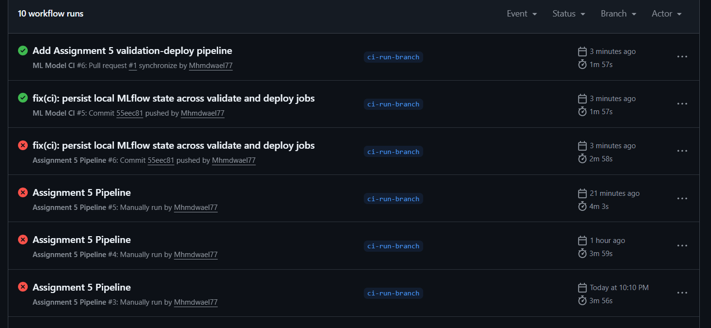
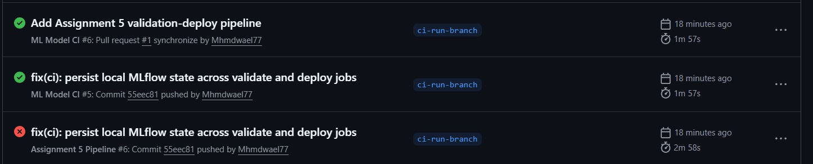

# Assignment 5 Report

## Title
Multi-Job CI/CD Pipeline for Model Validation and Mock Deployment

## Objective
The goal of this assignment was to build a two-job GitHub Actions pipeline that automates model validation and deployment.
The pipeline trains a classifier, logs results to MLflow, checks whether model accuracy meets a required threshold, and only then proceeds to a mock Docker deployment step.

## Workflow Design

### 1. Validation Job (`validate`)
The first job is responsible for:
- Pulling the training dataset using `dvc pull`
- Running `train.py` to train the model
- Logging the training run and accuracy metric to MLflow
- Saving the MLflow Run ID in `model_info.txt`
- Uploading `model_info.txt` as an artifact for the next job

### 2. Deployment Job (`deploy`)
The second job depends on the validation job and is responsible for:
- Downloading `model_info.txt` using `actions/download-artifact@v4`
- Running `check_threshold.py`
- Reading the MLflow Run ID from the artifact
- Fetching the logged accuracy from MLflow
- Failing the pipeline if the accuracy is below threshold
- Continuing to a mock Docker build if the threshold is satisfied

## MLflow Integration
MLflow was used as the tracking system for training runs.
Each training run logs the model accuracy metric and stores the associated Run ID.
The Run ID is passed from the `validate` job to the `deploy` job through GitHub Actions artifacts.

During development, an issue appeared because local MLflow state is not automatically shared across independent GitHub Actions jobs.
This was handled by persisting MLflow run reference data (`model_info.txt`) and reading the run again in the deploy phase before threshold gating.

## Threshold Logic
The deployment decision is controlled by `check_threshold.py`.
This script reads the Run ID from `model_info.txt`, retrieves the corresponding MLflow run, and checks the logged accuracy metric.

Pipeline behavior:
- If `accuracy < 0.85`, the deployment job fails.
- If `accuracy >= 0.85`, the deployment job continues and executes the mock Docker build step.

## Dockerfile
A simple Dockerfile was added to simulate deployment.
It:
- Uses `python:3.10-slim` as base image
- Accepts an argument called `RUN_ID`
- Simulates model download using `echo`

## Files Implemented
The following files were created or updated:
- `.github/workflows/pipeline.yml`
- `train.py`
- `check_threshold.py`
- `Dockerfile`
- `requirements.txt`

## Evidence

### Failed Run (accuracy below threshold)

### Successful Run (accuracy meets threshold)

## Conclusion
This assignment demonstrates a practical CI/CD workflow for machine learning models.
The pipeline separates validation from deployment, ensures that only acceptable models move forward, and shows how MLflow, DVC, GitHub Actions, and Docker can be combined in a practical automation workflow.
